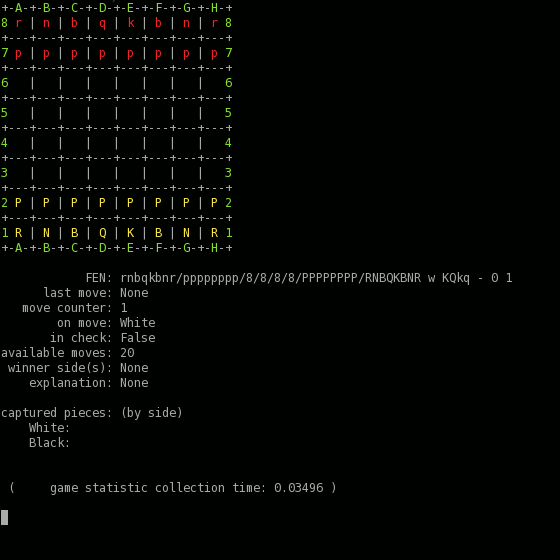

I don't know how you found this repository but I can guess that you
probably looking for some more popular and stable solution: [python-chess](https://pypi.python.org/pypi/python-chess)

[](https://travis-ci.org/gethiox/Chess)
[](https://codecov.io/gh/gethiox/Chess)

### What is that?
It's my private and not very well supported chess implementation at the
moment. If you are looking for something to read, i propose to start
over [variants.py](chess/app/variants.py) module or example files in the
root directory. Comments and pull requests are welcome.



### Why?
My aim of that project is to improve my skills and experimenting with
random things so you don't need to care about this repository.
Moreover the main goal of that project is to become as easy as possible
to extend, eg. for adding new chess variants and mechanics.  
Code quality and readability is more important than performance,
optimizations is a secondary matter and should never be at the first place
(if so it could be better and easier to use other language than Python).

`setup.py` are not yet provided, as long as it doesn't need any of
external libraries it is convenient to run provided example scripts
or create your own. Of course `setup.py` will be prepared in the near future.

Note:
If you read the code you could feel something weird about everything
that touches the Players and some other things. My approach is to
create very flexible implementation, even for more than two players
and chessboards that has more than two dimensions.  
Also I am going to remove most of `@property` decorators.

### Arbitrary development status
- [x] Classic Chess implementation
  - [x] Piece movement
  - [x] en-passant
  - [x] castling
- [ ] Some useful features
  - [x] Game end-state explanation (why game was interrupted, eg. insufficient material)
  - [x] FEN I/O support
  - [x] Chess engine handler (eg. for [stockfish](https://stockfishchess.org/))
  - [x] Full game move validation (check if move is possible according to the variation rules)
  - [x] Threefold repetition validation
  - [x] 50-move-rule validation
  - [x] simple insufficient material validation
  - [x] available moves generator (Note: inefficient)
  - [ ] chess-engine mode (Note: xD)
  - [ ] PGN move notation support
  - [ ] PGN game file reading/writing support
- [ ] Tests which given a proof that everything is working fine
  - [x] Base26 encoding and decoding
  - [ ] Game-logic tests
- [ ] Other variants
  - [x] King of the Hill
  - [x] Three Check
  - [ ] Chess960
  - [ ] CrazyHouse
  - [ ] Horde
  - [ ] PreChess
  - [ ] UpsideDown
  - [ ] Double Chess
  - [ ] Anti Chess
  - [ ] Racing Kings
  - [ ] Four player Chess
  - [ ] 3D Chess

### Examples

[example_app.py](example_app.py) - simple chess app to play with yourself
or against random response (`-r` flag, see `--help` for more)
```text
Move: 
bad syntax (Position should be given as two letter coordinates (file, rank))
Move: d1e1
+-A-+-B-+-C-+-D-+-E-+-F-+-G-+-H-+
8 r |   |   | q |   | b | n |   8
+---+---+---+---+---+---+---+---+
7   | p | p |   | p | k | p |   7
+---+---+---+---+---+---+---+---+
6 p |   |   | p |   |   |   |   6
+---+---+---+---+---+---+---+---+
5   |   |   | K |   | b |   | p 5
+---+---+---+---+---+---+---+---+
4   | n |   |   |   |   | r |   4
+---+---+---+---+---+---+---+---+
3   |   |   |   |   |   |   |   3
+---+---+---+---+---+---+---+---+
2 P | P | P | P |   | P | P | P 2
+---+---+---+---+---+---+---+---+
1 R | N | B |   | Q | B | N | R 1
+-A-+-B-+-C-+-D-+-E-+-F-+-G-+-H-+
On move: White, Available moves: 0
State: check mate, Winner(s): Black
```

[example_profile.py](example_profile.py) - move sequence executor, mainly for profiling purpose.
```text
+-A-+-B-+-C-+-D-+-E-+-F-+-G-+-H-+
8 r | n | b | q | k | b | n | r 8
+---+---+---+---+---+---+---+---+
7 p | p | p | p | p | p | p | p 7
+---+---+---+---+---+---+---+---+
6   |   |   |   |   |   |   |   6
+---+---+---+---+---+---+---+---+
5   |   |   |   |   |   |   |   5
+---+---+---+---+---+---+---+---+
4   |   |   |   |   |   |   |   4
+---+---+---+---+---+---+---+---+
3   |   |   |   |   |   |   |   3
+---+---+---+---+---+---+---+---+
2 P | P | P | P | P | P | P | P 2
+---+---+---+---+---+---+---+---+
1 R | N | B | Q | K | B | N | R 1
+-A-+-B-+-C-+-D-+-E-+-F-+-G-+-H-+

            FEN: rnbqkbnr/pppppppp/8/8/8/8/PPPPPPPP/RNBQKBNR w KQkq - 0 1
      last move: None
   move counter: 1
        on move: White
       in check: False
available moves: Disabled
 winner side(s): None
    explanation: None

captured pieces: (by side)
    White: None
    Black: None


 (     game statistic collection time: 0.00737 )

############################################################################

+-A-+-B-+-C-+-D-+-E-+-F-+-G-+-H-+
8   |   |   |   |   |   |   |   8
+---+---+---+---+---+---+---+---+
7   |   |   |   |   |   |   |   7
+---+---+---+---+---+---+---+---+
6   |   |   |   |   |   |   |   6
+---+---+---+---+---+---+---+---+
5   |   | k | b |   |   |   |   5
+---+---+---+---+---+---+---+---+
4   |   |   |   |   |   |   |   4
+---+---+---+---+---+---+---+---+
3 K |   |   |   |   |   |   |   3
+---+---+---+---+---+---+---+---+
2 r |   |   |   |   |   |   |   2
+---+---+---+---+---+---+---+---+
1   |   |   |   |   |   |   |   1
+-A-+-B-+-C-+-D-+-E-+-F-+-G-+-H-+

            FEN: 8/8/8/2kb4/8/K7/r7/8 w - - 22 155
      last move: b2a2
   move counter: 155
        on move: White
       in check: True
available moves: Disabled
 winner side(s): {<Black Side>}
    explanation: check mate

captured pieces: (by side)
    White: Knight, Pawn, Queen, Bishop, Rook, Knight, Pawn, Pawn, Pawn, Pawn, Pawn, Queen, Pawn
    Black: Bishop, Pawn, Queen, Knight, Rook, Pawn, Knight, Pawn, Pawn, Pawn, Pawn, Pawn, Pawn, Rook, Bishop

 ( move validation and execution time: 0.00087 )
 (     game statistic collection time: 0.00670 )

    all moves execution time: 2.1852, 308 moves in total, 0.0071 seconds on move
     slowest validation time: 0.0027 fastest: 0.0008
slowest data collection time: 0.0187 fastest: 0.0015
```

[example_cpu_vs_cpu.py](example_cpu_vs_cpu.py) - simple engine vs engine script.
Don't forget to look into `--help` to adjust some variables.
```text
+-A-+-B-+-C-+-D-+-E-+-F-+-G-+-H-+
8   |   |   |   |   |   |   |   8
+---+---+---+---+---+---+---+---+
7   |   |   |   |   |   |   |   7
+---+---+---+---+---+---+---+---+
6   |   |   |   |   |   |   | p 6
+---+---+---+---+---+---+---+---+
5   |   |   |   |   |   |   | P 5
+---+---+---+---+---+---+---+---+
4   |   |   |   |   |   |   | K 4
+---+---+---+---+---+---+---+---+
3   |   |   |   | k | q |   |   3
+---+---+---+---+---+---+---+---+
2   |   |   |   |   |   |   |   2
+---+---+---+---+---+---+---+---+
1   |   |   |   |   |   |   | r 1
+-A-+-B-+-C-+-D-+-E-+-F-+-G-+-H-+
FEN: 8/8/7p/7P/7K/4kq2/8/7r w - - 4 87
On move: White, last move: c1h1  Available moves: Disabled

Winner(s): Black  Moves: 172 Description: check mate
```